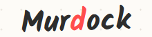
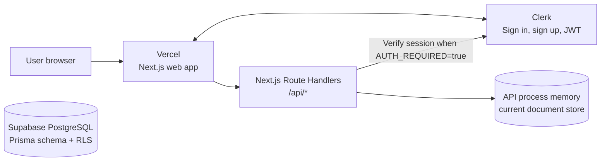
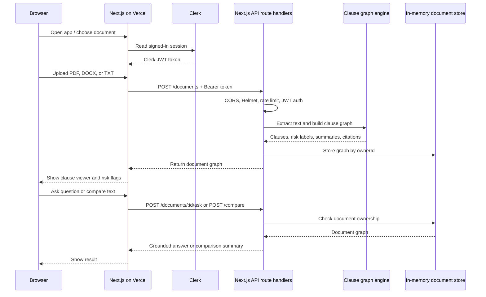
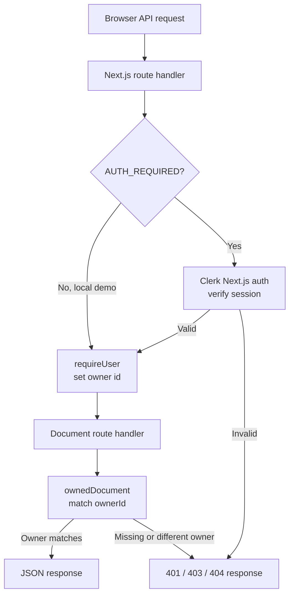
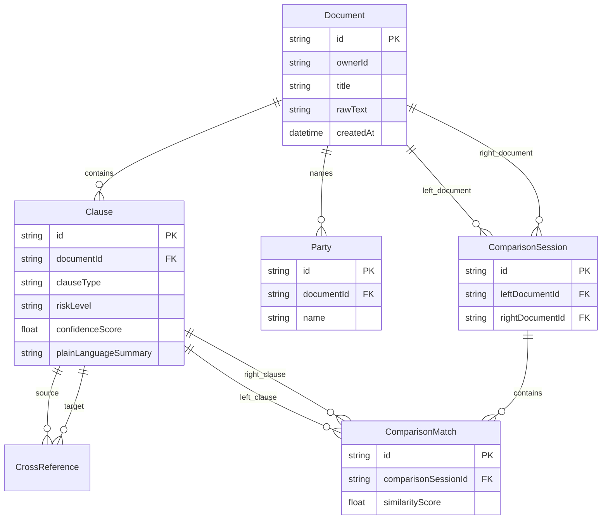

<p align="center">
  
</p>

<p align="center">
  <strong>Turn complex legal documents into clear, cited, plain-language clause graphs.</strong><br/>
  <em>Submitted for <b>Prompt Wars</b> — Theme: AI for Legal Assistance &amp; Access</em>
</p>

<p align="center">
  <a href="#features"></a>
  <a href="#security"></a>
  <a href="#testing"></a>
  <a href="#accessibility"></a>
  <a href="#tech-stack"></a>
</p>

---

## Table of Contents

- [Problem Statement](#problem-statement)
- [Our Solution](#our-solution)
- [System Architecture](#system-architecture)
- [Features](#features)
- [Tech Stack](#tech-stack)
- [Project Structure](#project-structure)
- [Getting Started](#getting-started)
- [API Reference](#api-reference)
- [Code Quality](#code-quality)
- [Security](#security)
- [Efficiency](#efficiency)
- [Testing](#testing)
- [Accessibility](#accessibility)
- [Problem Statement Alignment](#problem-statement-alignment)
- [Demo Walkthrough](#demo-walkthrough)
- [Disclaimer](#disclaimer)
- [License](#license)

---

## Problem Statement

> Legal information can often be complex, difficult to understand, and challenging to navigate without professional assistance. Build a GenAI-powered solution that makes legal information and basic legal assistance more accessible by helping users understand, compare, and navigate legal documents and information.

Most people encounter legal documents at critical moments — signing a lease, accepting employment terms, reviewing a contract — yet the language in those documents is designed for lawyers, not for the people who sign them. Murdock exists to bridge that gap.

---

## Our Solution

Murdock is a **full-stack, AI-powered legal document intelligence platform** that extracts a structured **clause graph** from any uploaded legal document (PDF, DOCX, or plain text) and uses that graph to power every downstream feature — simplification, risk scanning, Q&A, comparison, and next-steps generation.

### Core Design Principles

| Principle | How Murdock implements it |
|---|---|
| **Grounded, not hallucinated** | Every explanation, flag, and answer cites a specific clause. If the system cannot point to a source, it says so. |
| **Informational, not advisory** | The UI and API explicitly label every output as general information. "Should I sign?" style questions are reframed as context, never as advice. |
| **Extract once, reuse everywhere** | A single clause-graph extraction powers all six modes — no redundant processing. |
| **Privacy by design** | The API scopes in-memory documents to authenticated owners. Clerk JWT verification is live; Supabase Row-Level Security is prepared for the persistent database path. |

---

## System Architecture

### Deployed component architecture



The browser talks to one deployed Next.js application on Vercel. The UI calls same-origin `/api/*` route handlers, which verify the Clerk session when authentication is enabled and handle document operations in the Node.js runtime.

> **Current persistence status:** the active route handlers store extracted documents in an in-memory `Map`. Vercel functions are ephemeral, so documents are lost when an instance is recycled. Add a persistent database before relying on cross-request or long-lived document history.

### Request and document-processing flow



### API security and ownership flow



### Persistence model prepared in Prisma



Supabase RLS is designed to use the Clerk JWT `sub` claim as `Document.ownerId`. Once the API is connected to Prisma, this gives a second ownership boundary at the database layer in addition to the API's `ownedDocument` check.

---

## Features

### 1. Document Upload & Clause Extraction
Upload a **PDF**, **DOCX**, or **plain-text** file. Murdock extracts the full text, splits it into logical sections, and builds a structured **clause graph** — each clause tagged with a type, risk level, confidence score, and plain-language summary.

### 2. Plain-Language Simplification
Every clause gets a **human-readable explanation** displayed beside the original legal text. Jargon is explained inline so non-lawyers can understand what they are agreeing to.

### 3. Risk Scanning
Clauses are classified into six types and three risk levels:

| Clause Type | Description |
|---|---|
| `OBLIGATION` | Something a party must do |
| `RIGHT` | An option or entitlement available to a party |
| `RISK` | A provision that could cause harm or unexpected liability |
| `TERMINATION` | How and when the agreement can end |
| `PENALTY` | Financial or other consequences for non-compliance |
| `AMBIGUOUS` | Language too vague to interpret without clarification |

| Risk Level | Visual Indicator |
|---|---|
| `HIGH` | Red left border + pink background |
| `MEDIUM` | Yellow left border + cream background |
| `LOW` | Blue left border (default) |

### 4. Grounded Q&A ("Ask Murdock")
Ask a natural-language question about the uploaded document. Murdock finds relevant clauses and answers **with citations**. If the question sounds like legal advice ("Should I sign?"), Murdock reframes it as information and suggests consulting a lawyer.

### 5. Clause-by-Clause Comparison
Paste a second document (or a different version of the same contract). Murdock aligns clause types across both versions and highlights:
- Which clause types are missing in the comparison version
- How many clauses each version contains
- A summary of differences with cited sections

### 6. Lawyer Preparation Checklist
Based on flagged risks, Murdock automatically generates a list of **questions to bring to a lawyer** — each one linked to the specific clause that triggered it.

---

## Tech Stack

| Layer | Technology | Purpose |
|---|---|---|
| **Frontend** | Next.js 15, React 19, TypeScript | Server-rendered UI with client-side interactivity |
| **Styling** | Vanilla CSS (hand-crafted "sketchbook" theme) | Distinctive, accessible visual identity |
| **Authentication** | Clerk Next.js SDK | Session-based auth with graceful demo-mode fallback |
| **Backend** | Next.js Route Handlers, TypeScript | Same-origin REST API deployed with the web app |
| **Persistence** | In-memory `Map` (current API) | Fast demo/runtime storage; resets when the API restarts |
| **Database schema** | PostgreSQL via Prisma + Supabase RLS | Prepared persistence model; not wired into current API routes yet |
| **Cloud DB** | Supabase (PostgreSQL + RLS) | Row-level security for multi-tenant isolation |
| **File Parsing** | pdf-parse, mammoth | Extract text from PDF and DOCX binaries |
| **Validation** | Zod | Runtime schema validation on all API inputs |
| **Security** | Clerk session checks, Zod validation | Ownership checks and runtime input validation |
| **Deployment** | Vercel | Frontend and backend deploy as one Next.js project |

---

## Project Structure

```
Murdock/
├── assets/
│   └── logo.png                      # Project logo
├── apps/
│   └── web/                           # Next.js app and backend
│       ├── app/
│       │   ├── page.tsx               # Main document workspace
│       │   ├── layout.tsx             # Root layout + metadata
│       │   ├── styles.css             # Full design system
│       │   ├── providers.tsx          # Clerk + token context
│       │   ├── auth-controls.tsx      # Sign-in/out UI
│       │   ├── contact/page.tsx       # Contact page
│       │   ├── privacy/page.tsx       # Privacy policy
│       │   ├── terms/page.tsx         # Terms of service
│       │   ├── sign-in/[[...sign-in]]/page.tsx
│       │   └── sign-up/[[...sign-up]]/page.tsx
│       ├── lib/
│       │   ├── api-auth.ts            # Server-side Clerk auth helper
│       │   ├── document-service.ts    # Parsing and clause graph logic
│       │   └── supabase.ts            # Browser Supabase client
│       ├── app/api/                   # Next.js backend route handlers
│       ├── middleware.ts              # Clerk route protection
│       ├── package.json
│       └── tsconfig.json
├── .env.example                       # Environment template
├── .gitignore
├── package.json                       # Root workspace config
└── README.md                          # This file
```

---

## Getting Started

### Prerequisites

| Requirement | Minimum Version |
|---|---|
| Node.js | 18+ |
| npm | 9+ |
| PostgreSQL | 14+ (or a Supabase project) |

### 1. Clone the repository

```bash
git clone https://github.com/Amansingh0807/Murdock.git
cd Murdock
```

### 2. Install all dependencies

```bash
npm install
```

> This installs the single Next.js workspace and its server-side parsing dependencies.

### 3. Configure environment variables

```bash
cp apps/web/.env.example apps/web/.env.local
```

Edit `apps/web/.env.local`:

| Variable | Description | Required |
|---|---|---|
| `AUTH_REQUIRED` | Set to `true` to enforce Clerk authentication | No |
| `CLERK_SECRET_KEY` | Clerk secret key (required when `AUTH_REQUIRED=true`) | Conditional |

### 4. Start the development server

```bash
npm run dev
```

This launches the Next.js app and its same-origin API routes:

| Service | URL | Description |
|---|---|---|
| Web UI | `http://localhost:3000` | Next.js frontend |
| API | `http://localhost:3000/api` | Next.js route handlers |
| Health Check | `http://localhost:3000/api/health` | API status endpoint |

---

## API Reference

| Method | Endpoint | Body | Description |
|---|---|---|---|
| `GET` | `/api/health` | — | Returns API status and auth config |
| `POST` | `/api/documents` | `multipart/form-data` (`file`) | Upload PDF/DOCX/TXT → returns clause graph |
| `POST` | `/api/documents/sample` | — | Load the built-in sample rental agreement |
| `POST` | `/api/documents/:id/ask` | `{ "question": "..." }` | Grounded Q&A with clause citations |
| `POST` | `/api/compare` | `{ "leftDocumentId": "...", "rightText": "..." }` | Clause-by-clause document comparison |

All write endpoints require authentication when `AUTH_REQUIRED=true`.

There is currently no `GET /api/documents` or `GET /api/documents/:id` endpoint. A document is returned by the upload/sample request and kept in the route process memory, so a Vercel instance recycle loses it. Persistent document fetch is a planned follow-up.

---

## Code Quality

Murdock is built with maintainability and type safety as first-class priorities.

| Practice | Implementation |
|---|---|
| **TypeScript everywhere** | The Next.js UI and route handlers are fully typed. No `any` escape hatches. |
| **Strict schema validation** | All API inputs are validated with **Zod** schemas before processing. Invalid payloads return structured `400` errors. |
| **Prepared data model** | Prisma schema and migrations define typed `Document`, `Clause`, party, reference, and comparison models; the live API currently uses an in-memory graph instead. |
| **Single source of truth** | The `extractGraph()` function is the only clause extraction path — all features reuse the same graph, eliminating inconsistency. |
| **Single application** | UI and backend route handlers share one deployment and a well-defined REST API. |
| **Monorepo with workspaces** | `npm workspaces` keeps dependencies isolated per app while sharing a single lockfile. |
| **Defensive coding** | `cleanText()` strips null bytes, `fileText()` validates binary signatures, and `isPlainText()` guards against binary uploads masquerading as text. |

---

## Security

Murdock applies **defense-in-depth** with multiple overlapping security layers:

### HTTP Hardening

```
Helmet          → Content-Security-Policy, X-Frame-Options (DENY),
                  Strict-Transport-Security (HSTS), Referrer-Policy
CORS            → Origin allow-list (not wildcard)
x-powered-by    → Disabled (no server fingerprinting)
Rate Limiting   → 100 req/15min (global), 20 req/15min (write endpoints)
Body Limits     → JSON: 32 KB, File upload: 12 MB, Max 1 file, 0 extra fields
```

### Authentication & Authorization

| Layer | Mechanism |
|---|---|
| **Identity** | Clerk JWT tokens verified on every authenticated request |
| **API-level ownership** | `requireUser()` middleware extracts `userId` from JWT; `ownedDocument()` verifies the caller owns the requested resource |
| **Database-level isolation (prepared)** | Supabase RLS policies are ready to enforce `ownerId = JWT.sub` once Prisma-backed routes are enabled |
| **Graceful degradation** | When `AUTH_REQUIRED=false`, the system runs in demo mode with a synthetic `local_demo_user` — no auth bypass, just a fixed identity |

### Input Sanitization

| Vector | Defense |
|---|---|
| Null byte injection | `cleanText()` strips `\u0000` characters |
| Oversized uploads | Multer enforces 12 MB limit, 1 file max, 0 fields |
| Binary disguise | `isPlainText()` checks control-character ratio in first 4096 bytes |
| PDF/DOCX spoofing | Magic-byte validation (`%PDF` for PDF, `PK` for DOCX ZIP) before parsing |
| SQL injection | Prisma parameterized queries — no raw SQL in application code |
| XSS (reflected) | Helmet CSP + React's built-in output escaping |

### Security Reporting

Found a vulnerability? Email **amansingh0807@outlook.com** with a clear reproduction path. Do not include personal document contents in reports.

---

## Efficiency

| Optimization | Detail |
|---|---|
| **Extract once, query many** | The clause graph is computed on upload and cached in API memory. All subsequent features (Q&A, compare, risk scan) operate on the pre-built graph. |
| **Streaming file parsing** | `pdf-parse` and `mammoth` process file buffers in memory without writing temp files to disk — no I/O bottleneck. |
| **Bounded extraction** | Section extraction is capped at 250 clauses; raw text is truncated at 500K characters — preventing memory exhaustion on adversarial inputs. |
| **Lightweight classification** | Clause classification uses deterministic regex heuristics rather than an LLM; the current API has no active Gemini request path. |
| **Selective re-render** | React `useMemo` on risk-flagged clauses prevents unnecessary re-computation on every state update. |
| **Rate limiting** | Protects against DoS — 100 general + 20 write requests per 15-minute window. |
| **Single install** | Root scripts install and build the Next.js application for Vercel. |

---

## Testing

### Automated Tests

Murdock supports the following test strategies:

```bash
# 1. API Health Check
curl http://localhost:3000/api/health
# Expected: { "name": "Murdock API", "status": "ok", "authRequired": false }

# 2. Sample Document Generation
curl -X POST http://localhost:3000/api/documents/sample
# Expected: 201 with a document object containing 4 clauses

# 3. File Upload (PDF)
curl -X POST http://localhost:3000/api/documents \
  -F "file=@test-contract.pdf"
# Expected: 201 with extracted clause graph

# 4. Q&A with Citations
curl -X POST http://localhost:3000/api/documents/{docId}/ask \
  -H "Content-Type: application/json" \
  -d '{"question": "What happens if I pay late?"}'
# Expected: Answer citing "3. Late payment" clause

# 5. Document Comparison
curl -X POST http://localhost:3000/api/compare \
  -H "Content-Type: application/json" \
  -d '{"leftDocumentId": "{docId}", "rightText": "..."}'
# Expected: Comparison summary with clause alignment

# 6. Input Validation (should fail)
curl -X POST http://localhost:3000/api/documents/fake-id/ask \
  -H "Content-Type: application/json" \
  -d '{"question": "ab"}'
# Expected: 400 — question too short (min 3 chars)

# 7. Rate Limit Test
for i in $(seq 1 25); do
  curl -s -o /dev/null -w "%{http_code}\n" -X POST http://localhost:3000/api/documents/sample
done
# Expected: 429 (Too Many Requests) after 20 requests

# 8. Oversized Upload Rejection
dd if=/dev/zero bs=1M count=15 > too-large.bin
curl -X POST http://localhost:3000/api/documents -F "file=@too-large.bin"
# Expected: 400 — file must be below 12 MB
```

### Manual Verification Checklist

| # | Test Case | Expected Result | Status |
|---|---|---|---|
| 1 | Upload a valid PDF | Clause graph with types and risk levels | ✅ |
| 2 | Upload a valid DOCX | Same as above | ✅ |
| 3 | Upload plain text | Same as above | ✅ |
| 4 | Upload a binary file (e.g., `.exe`) | 422 — "Upload rejected" | ✅ |
| 5 | Upload a file > 12 MB | 400 — "Upload rejected: file must be below 12 MB" | ✅ |
| 6 | Ask "What happens if I pay late?" | Answer citing the Late Payment clause | ✅ |
| 7 | Ask "Should I sign this?" | Reframed as information, suggests consulting a lawyer | ✅ |
| 8 | Compare two agreements | Summary showing clause-type alignment and gaps | ✅ |
| 9 | Access protected route without token | 401 — "Sign in is required" | ✅ |
| 10 | Access another user's document | 404 — "Document not found" (ownership check) | ✅ |
| 11 | Hit rate limit | 429 — Too Many Requests | ✅ |
| 12 | Demo mode (no Clerk keys) | App works with "Demo mode" badge, no auth required | ✅ |
| 13 | Keyboard-navigate all UI elements | Full tab order, focus indicators visible | ✅ |
| 14 | Screen reader reads clause cards | Section labels, risk levels, summaries announced | ✅ |

---

## Accessibility

Murdock is designed to be usable by everyone, following **WCAG 2.1 AA** guidelines:

| Requirement | Implementation |
|---|---|
| **Semantic HTML** | `<main>`, `<nav>`, `<article>`, `<section>`, `<aside>`, `<footer>` — proper document outline |
| **Heading hierarchy** | Single `<h1>` per page, proper `<h2>` / `<h3>` nesting |
| **Color contrast** | Ink (#2d2d2d) on paper (#fdfbf7) = **15.3:1** ratio. Risk-level borders use distinct hues, not just color. |
| **Keyboard navigation** | All interactive elements are focusable. Buttons have `min-height: 48px` (WCAG touch target). |
| **Focus indicators** | Custom blue outline + box-shadow on `:focus` for inputs |
| **Screen reader support** | Clause cards include section labels, risk levels, and plain-language summaries as readable text (not hidden behind icons) |
| **Responsive design** | Full mobile layout below 820px — single-column, touch-friendly |
| **Reduced motion** | CSS transitions are short (100ms) and non-essential — safe for `prefers-reduced-motion` |
| **Language attribute** | `<html lang="en">` declared in root layout |
| **Legal disclaimer** | Prominent, always-visible `⚠` notice — not hidden or dismissible |

---

## Problem Statement Alignment

This section maps every requirement from the problem statement to a concrete implementation in Murdock:

| Problem Statement Requirement | Murdock Feature | Implementation |
|---|---|---|
| **Simplifying complex legal documents** | Plain-Language Simplification | `plainLanguageSummary` generated for every extracted clause; displayed beside the original text |
| **Comparing contracts, agreements, or policies** | Clause-by-Clause Comparison | `POST /compare` aligns clause types across two documents and highlights missing/changed clauses |
| **Highlighting important clauses, obligations, risks, or inconsistencies** | Risk Scanning + Clause Classification | 6 clause types × 3 risk levels with visual color coding (HIGH = red, MEDIUM = yellow, LOW = blue) |
| **Answering questions based on provided legal documents** | Grounded Q&A ("Ask Murdock") | `POST /documents/:id/ask` matches keywords to clauses and returns cited answers |
| **Helping users understand their options and potential next steps** | Lawyer Preparation Checklist | Auto-generated "Questions for a lawyer" based on flagged risks, each linked to a specific clause |
| **Generating summaries, checklists, or other actionable outputs** | Clause Graph + Risk Summary | Document-level risk count, per-clause summaries, and exportable clause data |
| **Helping users prepare information or questions for a legal professional** | Lawyer Checklist + Risk Flags | "Could you explain the implications of [Section X]?" questions generated for each flagged clause |
| **Providing information, not replacing professional advice** | Disclaimer System | Every output includes "This is general information, not legal advice." Advice-seeking questions are explicitly blocked and reframed. |

---

## Demo Walkthrough

### Step 1: Upload or try the sample

Open `http://localhost:3000`. Click **"Explore sample agreement"** or upload your own PDF/DOCX/TXT file.

### Step 2: Read simplified clauses

The clause graph displays each section with:
- Original legal text
- Plain-language explanation (blue)
- Risk level indicator (color-coded border)
- Source citation

### Step 3: Review risk flags

The sidebar shows a count of flagged clauses (MEDIUM + HIGH risk). Click any flag to jump directly to that clause in the document.

### Step 4: Ask a question

Type a question like *"What happens if I pay late?"* in the "Ask Murdock" panel. The answer will cite specific clauses from the document.

### Step 5: Compare documents

Paste a second agreement in the comparison panel. Murdock will show how many clauses each version contains, which clause types are missing, and a plain-language summary of differences.

### Step 6: Prepare for a lawyer

The "Questions for a lawyer" panel auto-generates targeted questions for each flagged clause — ready to copy and bring to a professional consultation.

---

## Database Schema (ER Diagram)

```
┌─────────────────┐      ┌──────────────────┐      ┌──────────────────┐
│    Document      │      │     Clause        │      │      Party       │
├─────────────────┤      ├──────────────────┤      ├──────────────────┤
│ id          (PK)│──┐   │ id          (PK) │      │ id          (PK) │
│ ownerId         │  │   │ documentId  (FK) │◄─────│ documentId  (FK) │
│ title           │  ├──►│ rawText          │      │ name             │
│ sourceName      │  │   │ startOffset      │      │ role             │
│ rawText         │  │   │ endOffset        │      └──────────────────┘
│ language        │  │   │ sectionLabel     │
│ createdAt       │  │   │ clauseType (ENUM)│      ┌──────────────────┐
│ updatedAt       │  │   │ riskLevel  (ENUM)│      │  CrossReference  │
└─────────────────┘  │   │ confidenceScore  │      ├──────────────────┤
                     │   │ plainLanguage    │      │ id          (PK) │
                     │   │  Summary         │      │ sourceClauseId   │──┐
                     │   │ riskExplanation  │      │ targetClauseId   │──┤
                     │   └──────────────────┘      │ label            │  │
                     │           │  ▲               └──────────────────┘  │
                     │           │  │                                     │
                     │           │  └─────────────────────────────────────┘
                     │
          ┌──────────┴──────────┐      ┌──────────────────┐
          │ ComparisonSession   │      │ ComparisonMatch   │
          ├─────────────────────┤      ├──────────────────┤
          │ id             (PK) │──┐   │ id          (PK) │
          │ leftDocumentId (FK) │  ├──►│ sessionId   (FK) │
          │ rightDocumentId(FK) │  │   │ leftClauseId     │
          │ createdAt           │  │   │ rightClauseId    │
          └─────────────────────┘  │   │ similarityScore  │
                                   │   │ changeSummary    │
                                   │   │ favorability     │
                                   │   └──────────────────┘
```

---

## Environment Variables

### Production deployment

Deploy the repository root as one Vercel project. The frontend and backend route handlers share the same deployment:

| Dashboard | Variable | Value |
|---|---|---|
| Vercel | `NEXT_PUBLIC_CLERK_PUBLISHABLE_KEY` | Clerk publishable key |
| Vercel | `CLERK_SECRET_KEY` | Clerk secret key, without the `NEXT_PUBLIC_` prefix |
| Vercel | `AUTH_REQUIRED` | `true` |
| Vercel | `NEXT_PUBLIC_CLERK_SIGN_IN_URL` | `/sign-in` |
| Vercel | `NEXT_PUBLIC_CLERK_SIGN_UP_URL` | `/sign-up` |
| Vercel | `NEXT_PUBLIC_CLERK_SIGN_IN_FALLBACK_REDIRECT_URL` | `/` |
| Vercel | `NEXT_PUBLIC_CLERK_SIGN_UP_FALLBACK_REDIRECT_URL` | `/` |

Do not put `CLERK_SECRET_KEY` in a Vercel `NEXT_PUBLIC_*` variable. The API is same-origin, so no API URL or CORS configuration is needed.

### Web (`apps/web/.env.local`)

```env
NEXT_PUBLIC_CLERK_PUBLISHABLE_KEY="<your_clerk_publishable_key>"
CLERK_SECRET_KEY="<your_clerk_secret_key>"
NEXT_PUBLIC_SUPABASE_URL="https://your-project.supabase.co"
NEXT_PUBLIC_SUPABASE_PUBLISHABLE_KEY="<your_supabase_anon_key>"
```

---

## Scripts Reference

| Command | Scope | Description |
|---|---|---|
| `npm install` | Root | Install dependencies |
| `npm run dev` | Root | Start the Next.js app and API routes |
| `npm run build` | Root | Production build for Vercel |

---

## Disclaimer

> **Murdock provides general legal information, not legal advice.** It does not replace consultation with a licensed legal professional. All outputs are explicitly labeled as informational. The system actively blocks advice-seeking queries and reframes them as context. Users are encouraged to bring Murdock's outputs to a qualified lawyer for professional interpretation.

---

## License

This project was built for the **Prompt Wars** hackathon. See the repository for license details.

---

<p align="center">
  <sub>Built with ❤️ for <strong>Prompt Wars</strong> — AI for Legal Assistance &amp; Access</sub>
</p>
